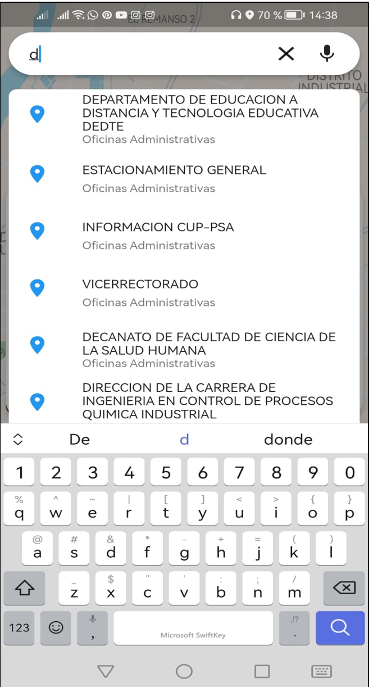

# Système d'information géographique pour l'Université Gabriel René Moreno

[English](./README.md) | [Español](./README.es.md) | [Français](./README.fr.md) | [日本語](./README.jp.md)

## Description

Ce projet est une application mobile développée en Flutter qui utilise le Système d'Information Géographique (SIG) pour localiser des lieux au sein de l'Université Gabriel René Moreno. L'application exploite la carte de Google Maps pour permettre aux utilisateurs de marquer leur point de départ, puis de rechercher et de générer des itinéraires vers différents endroits à l'intérieur du campus universitaire.

## Principales caractéristiques

- **Localisation des lieux**: Les utilisateurs peuvent utiliser l'application pour trouver des endroits spécifiques au sein de l'Université Gabriel René Moreno. L'application propose un moteur de recherche intégré qui permet aux utilisateurs de rechercher un lieu particulier, comme une faculté, une bibliothèque ou un bâtiment administratif.

- **Génération d'itinéraires**: Une fois que l'utilisateur a sélectionné un lieu de destination, l'application génère un itinéraire en utilisant Google Maps pour guider l'utilisateur depuis son point de départ jusqu'à l'endroit sélectionné. L'itinéraire fournit des instructions étape par étape pour faciliter la navigation à l'intérieur du campus universitaire.

- **Interface intuitive**: L'application dispose d'une interface utilisateur intuitive et facile à utiliser. Les utilisateurs peuvent sélectionner leur point de départ sur la carte, utiliser le moteur de recherche pour trouver le lieu souhaité et visualiser l'itinéraire généré de manière claire et concise.

## Exigences système

- Appareil mobile avec un système d'exploitation Android ou iOS.
- Connexion Internet pour accéder aux services de Google Maps.

## Installation

1. Clonez ce dépôt sur votre machine locale.
2. Assurez-vous d'avoir Flutter installé sur votre système.
3. Ouvrez le projet dans votre éditeur de code préféré.
4. Exécutez la commande suivante dans le terminal pour installer les dépendances du projet :

```shell
   flutter pub get
```

5. Connectez votre appareil mobile ou démarrez un émulateur.
6. Exécutez la commande suivante pour compiler et exécuter l'application :

```shell
   flutter run
```

## Captures d'écran

| **Dashboard** | **Search Results** | **Options** |
|:-------------------:|:--------------------------:|:----------------:|
|  |  |  |


## Contribution

Si vous souhaitez contribuer à ce projet, suivez ces étapes :

1. Effectuez un fork de ce dépôt.
2. Créez une branche avec une description claire de la fonction ou de la correction que vous effectuez.
3. Effectuez vos changements et effectuez un commit avec un message descriptif.
4. Envoyez une pull request expliquant les changements effectués et leur objectif.

## Licence

Ce projet est sous licence [MIT](https://opensource.org/licenses/MIT). Vous pouvez obtenir plus d'informations en consultant le fichier [LICENSE](LICENSE) du projet.
