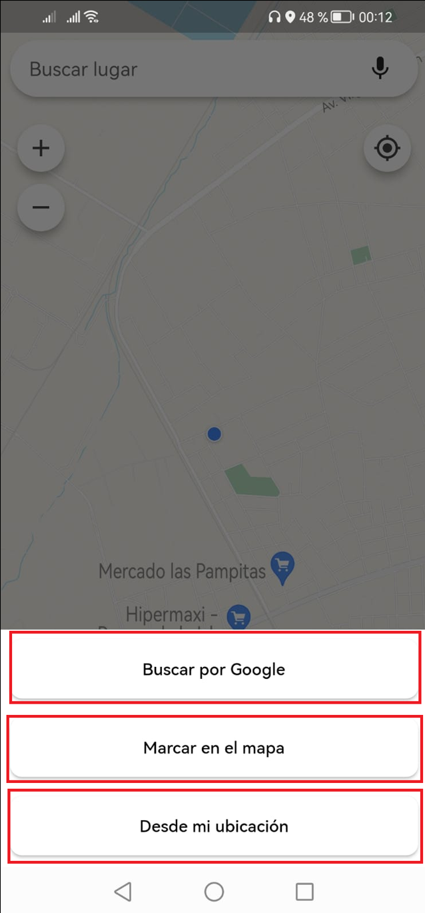

# ガブリエル・レネ・モレノ大学の地理情報システム

[English](./README.md) | [Español](./README.es.md) | [Français](./README.fr.md) | [日本語](./README.jp.md)

## 説明

このプロジェクトは、ガブリエル・レネ・モレノ大学内の場所を特定するために地理情報システム（GIS）を使用するFlutterで開発されたモバイルアプリケーションです。アプリケーションはGoogle Mapsのマップを活用して、ユーザーが出発点をマークし、それからキャンパス内のさまざまな場所への経路を検索および生成できるようにします。

## 主な機能

- **場所の特定**: ユーザーはガブリエル・レネ・モレノ大学内の特定の場所を見つけるためにこのアプリケーションを使用できます。アプリケーションには、ユーザーが特定の場所（学部、図書館、行政ビルなど）を検索できる統合された検索機能が備わっています。

- **経路の生成**: ユーザーが目的地を選択すると、アプリケーションはGoogle Mapsを使用して出発点から選択した場所までユーザーを案内する経路を生成します。経路はキャンパス内でのナビゲーションを容易にするためにステップバイステップの指示を提供します。

- **直感的なインターフェース**:アプリケーションは直感的で使いやすいユーザーインターフェースを備えています。ユーザーはマップ上で出発点を選択し、検索機能を使用して目的の場所を見つけ、生成された経路を明確かつ簡潔に表示できます。

## システム要件

- AndroidまたはiOSオペレーティングシステムを搭載したモバイルデバイス。
- Google Mapsのサービスにアクセスするためのインターネット接続。

## インストール

1. このリポジトリをローカルマシンにクローンします。
2. システムにFlutterがインストールされていることを確認します。
3. 好みのコードエディタでプロジェクトを開きます。
4. プロジェクトの依存関係をインストールするためにターミナルで次のコマンドを実行します：

```shell
   flutter pub get
```

5. モバイルデバイスを接続するかエミュレータを起動します。
6. アプリケーションをコンパイルおよび実行するために次のコマンドを実行します：

```shell
   flutter run
```

## スクリーンショット

| **ダッシュボード** | **検索結果** | **オプション** |
|:-------------------:|:--------------------------:|:----------------:|
|  |  |  |


## 貢献

このプロジェクトに貢献したい場合は、以下の手順に従ってください：

1. このリポジトリをフォークします。
2. 実施している機能や修正について明確な説明を含むブランチを作成します。
3. 変更を行い、説明的なメッセージを添えてコミットします。
4. 変更内容とその目的を説明するプルリクエストを送信します。

## ライセンス


ガブリエル・レネ・モレノ大学の地理情報システム

説明

このプロジェクトは、ガブリエル・レネ・モレノ大学内の場所を特定するために地理情報システム（GIS）を使用するFlutterで開発されたモバイルアプリケーションです。アプリケーションはGoogle Mapsのマップを活用して、ユーザーが出発点をマークし、それからキャンパス内のさまざまな場所への経路を検索および生成できるようにします。

主な機能

場所の特定: ユーザーはガブリエル・レネ・モレノ大学内の特定の場所を見つけるためにこのアプリケーションを使用できます。アプリケーションには、ユーザーが特定の場所（学部、図書館、行政ビルなど）を検索できる統合された検索機能が備わっています。

経路の生成: ユーザーが目的地を選択すると、アプリケーションはGoogle Mapsを使用して出発点から選択した場所までユーザーを案内する経路を生成します。経路はキャンパス内でのナビゲーションを容易にするためにステップバイステップの指示を提供します。

直感的なインターフェース: アプリケーションは直感的で使いやすいユーザーインターフェースを備えています。ユーザーはマップ上で出発点を選択し、検索機能を使用して目的の場所を見つけ、生成された経路を明確かつ簡潔に表示できます。

システム要件

AndroidまたはiOSオペレーティングシステムを搭載したモバイルデバイス。
Google Mapsのサービスにアクセスするためのインターネット接続。
インストール

このリポジトリをローカルマシンにクローンします。

システムにFlutterがインストールされていることを確認します。

好みのコードエディタでプロジェクトを開きます。

プロジェクトの依存関係をインストールするためにターミナルで次のコマンドを実行します：

モバイルデバイスを接続するかエミュレータを起動します。

アプリケーションをコンパイルおよび実行するために次のコマンドを実行します：

スクリーンショット

貢献

このプロジェクトに貢献したい場合は、以下の手順に従ってください：

このリポジトリをフォークします。
実施している機能や修正について明確な説明を含むブランチを作成します。
変更を行い、説明的なメッセージを添えてコミットします。
変更内容とその目的を説明するプルリクエストを送信します。
ライセンス

このプロジェクトは [MITライセンス](https://opensource.org/licenses/MIT)の下にあります。プロジェクトの [ライセンスファ](LICENSE) を参照して詳細を確認できます。
