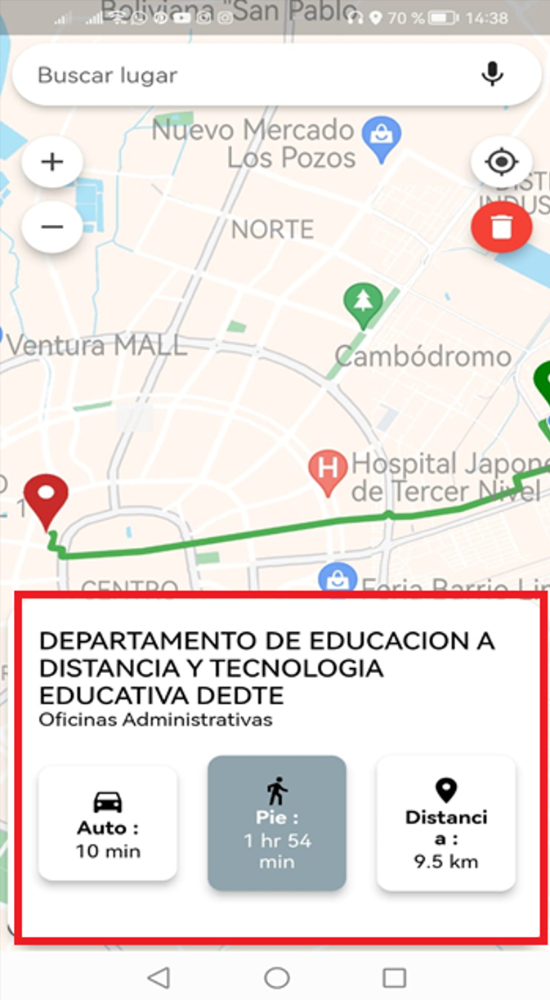
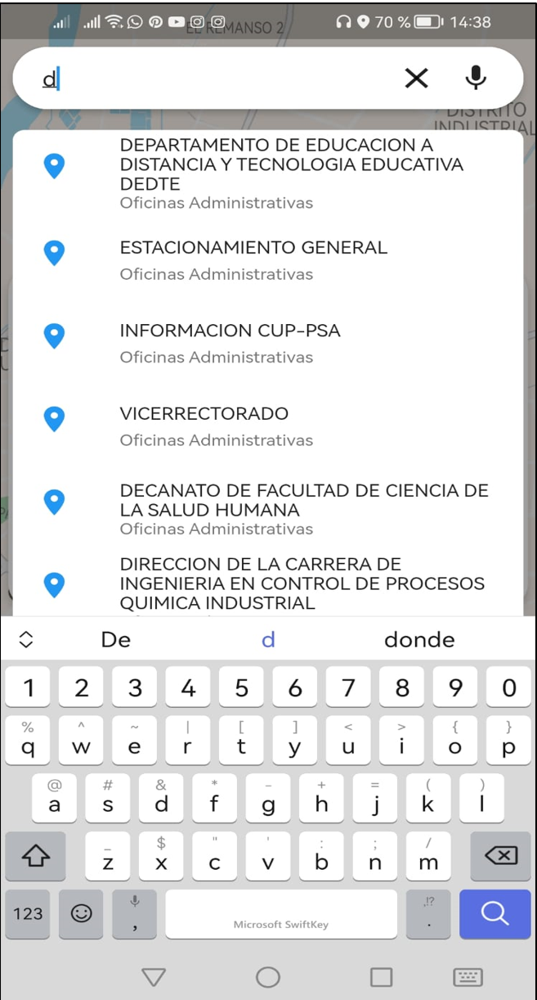
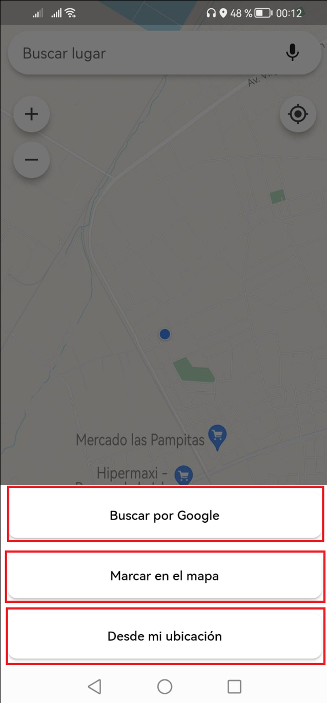

# Geographic Information System for Gabriel René Moreno University

[English](./README.md) | [Español](./README.es.md) | [Français](./README.fr.md) | [日本語](./README.jp.md)

<p align="center">
  
</p>

## Description

This project is a mobile application developed in Flutter that utilizes the Geographic Information System (GIS) to locate places within Gabriel René Moreno University. The application leverages Google Maps to allow users to mark their starting point and then search and generate routes to different locations within the university campus.

## Key Features

- **Location of places**: Users can use the application to find specific places within Gabriel René Moreno University. The application offers an integrated search function that allows users to search for a particular place, such as a faculty, library, or administrative building.

- **Route generation**: Once the user has selected a destination, the application generates a route using Google Maps to guide the user from their starting point to the selected location. The route provides step-by-step instructions to facilitate navigation within the university campus.

- **Intuitive interface**: The application has an intuitive and user-friendly interface. Users can select their starting point on the map, use the search function to find the desired place, and view the generated route clearly and concisely.

## System Requirements

- Mobile device with Android or iOS operating system.
- Internet connection to access Google Maps services.

## Installation

1. Clone this repository to your local machine.
2. Make sure you have Flutter installed on your system.
3. Open the project in your preferred code editor.
4. Execute the following command in the terminal to install project dependencies:

```shell
   flutter pub get
```

5. Connect your mobile device or start an emulator.
6. Execute the following command to compile and run the application:

```shell
   flutter run
```

## Screenshots

| **Dashboard** | **Search Results** | **Options** |
|:-------------------:|:--------------------------:|:----------------:|
|  |  |  |


## Contribution

If you wish to contribute to this project, follow these steps:

1. Fork this repository.
2. Create a branch with a clear description of the feature or fix you are implementing.
3. Make your changes and commit with a descriptive message.
4. Submit a pull request explaining the changes made and their purpose.

## Licencia

This project is under the [MIT License](https://opensource.org/licenses/MIT). You can obtain more information by consulting the project's [LICENSE](LICENSE) file.
